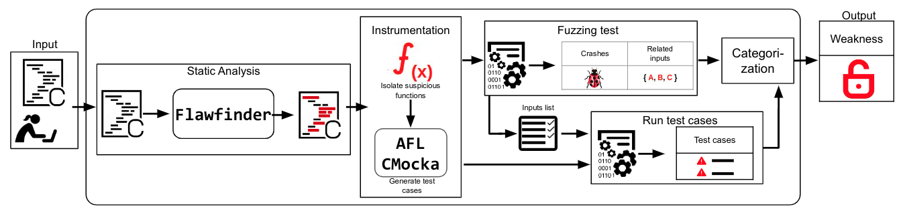
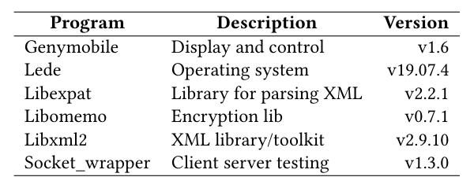
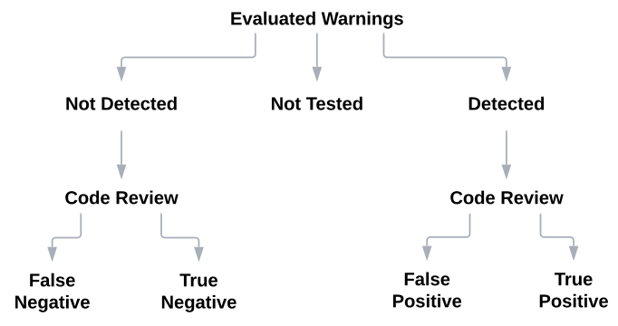
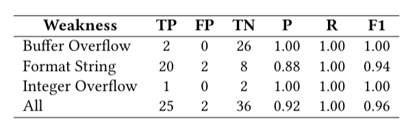
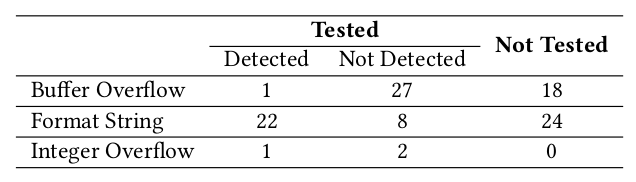
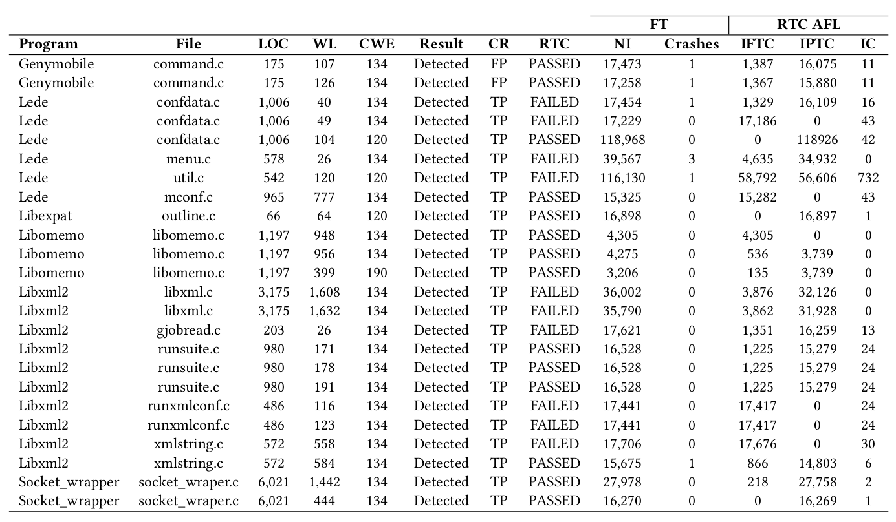

# Weaknesses Testing Tool 
## Towards a Technique to Detect Weaknesses in C Programs.

  A testing framework to reports weaknesses in C programs.

## Abstract

  
 Several critical systems, such as Linux, are implemented using theC language, and a security flaw in these systems may impact a vastnumber of users. Despite the effort to provide security support,these systems still have weaknesses, leading to vulnerable code. Infact, the number of reported vulnerabilities has increased in the lastyears, where more than 18 thousand vulnerabilities were reported tothe National Vulnerability Database (NVD) in 2020. Static analysistools, such as Flawfinder and Cppcheck, may help in this problem,reporting some kinds of weaknesses. However, they present a highrate of false alarms, an issue reported in a program when no prob-lem actually exists. We present a technique that combines staticanalysis with software testing to detect weaknesses introduced inthe code during earlier development stages of C programs. Thetechnique is implemented in a framework named WTT. To verifyour technique’s relevance, we evaluate 103 warnings of 6 differentprojects, and we detected 22 weaknesses of three different kinds:Buffer Overflow, Format String, and Integer Overflow. Results showevidence that our technique may help developers anticipate weak-ness detection in C programs, contributing to reducing vulnerabilityoccurrence in operational versions. 

  
## Technique
### Overview

  
 It the first phase, the technique receives a C file and executesstatic analysis with the aim to identify suspicious code. This phasepresents as output a list of suspicious code snippets. In this phase,WTT uses the Flawfinder tool (Phase: Static Analysis). Next, wemanually isolate the suspicious functions and generate suitabletest cases according to the kind of weakness, mocking functiondependencies. In this phase, WTT uses the american fuzzy lop(AFL) fuzzer and the CMocka framework (Phase: Instrumentation).Next, we perform fuzzing testing to verify if the weaknesses causesome crash in the code with the inputs generated by AFL (Phase:Fuzzing testing). In this phase, we store the list of inputs generatedby the fuzzer to be reused in the next phase. Next, we execute thetest cases with the values generated by the fuzzer and special values. guessed by the developers to verify unexpected behaviours causedby the weakness (Phase: Run test cases). Finally, we automaticallycategorize the set of weaknesses and generate a report with a listof inputs and their related test results: passed, failed, or crashed.We also define whether a suspicious code can be classified as aweakness based on the results obtained in the Fuzzing Testing andRun Test Cases phases (Phase: Categorization). 

The WTT framework.

## Evaluation

Overview of the selected subjects.

The Process of Warnings Classification..

Metrics for each type of weakness: True Positive (TP); False Positive (FP); True Negative (TN); False Negative (FN); Precision (P), Recall (R), and F1 score.

Analyzed warnings classified by type.

Results of performing WTT on C projects to detect weaknesses; LOC = Lines of code; WL = Weakness Line; CR = Code Review; RTC = Run test case with special value; FT = Fuzzing testing; NI = Number of inputs; RTC/AFL = Run test cases with AFL inputs; IFTC = Inputs that made the test cases fail; IPTC = Inputs that made the test cases pass; IC = inputs that made crash;

### Support or Contact

- Check out our [GitHub](https://github.com/WeaknessesTesting/wtt).
- ...
